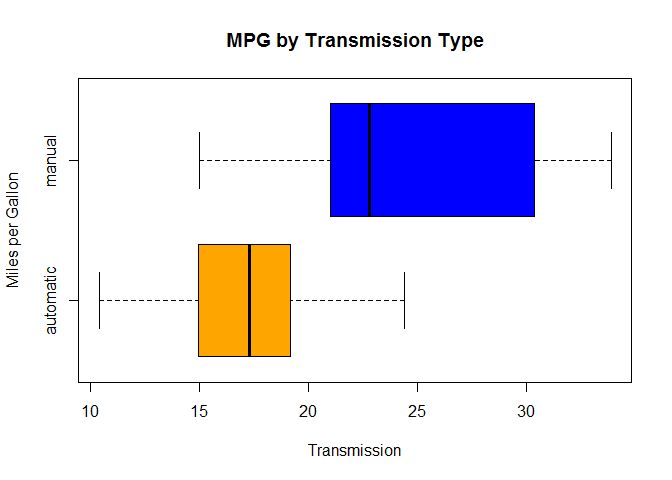
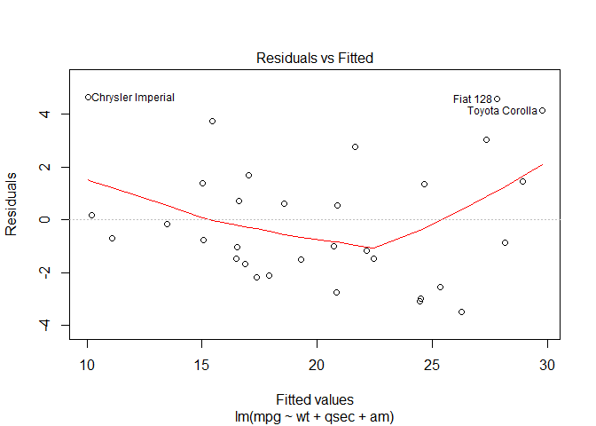

# Regression Models Course Project
Massimiliano Figini  
13 gennaio 2017  


# Miles Per Gallon: Automatic vs Manual Transmission


### Summary

This document use the data of the mtcars package for the analysis. The data was extracted from the 1974 Motor Trend US magazine, and comprises fuel consumption and 10 aspects of automobile design and performance for 32 automobiles (1973-74 models).  
The goal is answer at this question: "is an automatic or manual transmission better for MPG?"  and quantify the MPG difference between the transmissions.   
Based on the data, this document show that the manual transmission is better than the automatic for the mpg: all the models tested say this.   
The best model says that the manual transmission allow to do an average of 2.396 miles plus then the automatic.  


### Intro

mtcars have 32 observations on 11 variables:  
 1	 mpg:	  Miles/(US) gallon  
 2	 cyl:	  Number of cylinders  
 3	 disp:	Displacement (cu.in.)  
 4	 hp:	  Gross horsepower  
 5	 drat:  Rear axle ratio  
 6	 wt:	  Weight (1000 lbs)  
 7	 qsec:	1/4 mile time  
 8	 vs:	  V/S  
 9	 am:	  Transmission (0 = automatic, 1 = manual)  
10	 gear:	Number of forward gears  
11	 carb:	Number of carburetors


The variables am and vs must be model as factor variables:

```r
data(mtcars)
mtcars$vs <- as.factor(mtcars$vs)
mtcars$am <- as.factor(mtcars$am)
```


### Exploratory analysis

Base statistics:


```r
summary(mtcars)
```

```
##       mpg             cyl             disp             hp       
##  Min.   :10.40   Min.   :4.000   Min.   : 71.1   Min.   : 52.0  
##  1st Qu.:15.43   1st Qu.:4.000   1st Qu.:120.8   1st Qu.: 96.5  
##  Median :19.20   Median :6.000   Median :196.3   Median :123.0  
##  Mean   :20.09   Mean   :6.188   Mean   :230.7   Mean   :146.7  
##  3rd Qu.:22.80   3rd Qu.:8.000   3rd Qu.:326.0   3rd Qu.:180.0  
##  Max.   :33.90   Max.   :8.000   Max.   :472.0   Max.   :335.0  
##       drat             wt             qsec       vs     am    
##  Min.   :2.760   Min.   :1.513   Min.   :14.50   0:18   0:19  
##  1st Qu.:3.080   1st Qu.:2.581   1st Qu.:16.89   1:14   1:13  
##  Median :3.695   Median :3.325   Median :17.71                
##  Mean   :3.597   Mean   :3.217   Mean   :17.85                
##  3rd Qu.:3.920   3rd Qu.:3.610   3rd Qu.:18.90                
##  Max.   :4.930   Max.   :5.424   Max.   :22.90                
##       gear            carb      
##  Min.   :3.000   Min.   :1.000  
##  1st Qu.:3.000   1st Qu.:2.000  
##  Median :4.000   Median :2.000  
##  Mean   :3.688   Mean   :2.812  
##  3rd Qu.:4.000   3rd Qu.:4.000  
##  Max.   :5.000   Max.   :8.000
```

The boxplot shown the miles per gallon by transmission type:


```r
boxplot(mpg ~ am, data = mtcars,
         col  = c("orange", "blue"),
         xlab = "Transmission",
         ylab = "Miles per Gallon",
         main = "MPG by Transmission Type",
         names= c("automatic","manual"),
         horizontal= T) 
```

<!-- -->

Manual transimission seems better seeing the boxplot.    


### Test

Have a test for the hypotesis that mean mpg for manual and automatic transmission is similar.   


```r
auto=subset(mtcars,select=mpg,am==0)
manual=subset(mtcars,select=mpg,am==1)
t.test(auto,manual)
```

```
## 
## 	Welch Two Sample t-test
## 
## data:  auto and manual
## t = -3.7671, df = 18.332, p-value = 0.001374
## alternative hypothesis: true difference in means is not equal to 0
## 95 percent confidence interval:
##  -11.280194  -3.209684
## sample estimates:
## mean of x mean of y 
##  17.14737  24.39231
```

Null hypotesis (mean mpg for automatic and manual are similar) rejected.   


### Linear Regressions

First I do a simple regression with am dependent variable and mpg independent.  


```r
regSIM <- lm(mpg~am,mtcars) 
summary(regSIM) 
```

```
## 
## Call:
## lm(formula = mpg ~ am, data = mtcars)
## 
## Residuals:
##     Min      1Q  Median      3Q     Max 
## -9.3923 -3.0923 -0.2974  3.2439  9.5077 
## 
## Coefficients:
##             Estimate Std. Error t value Pr(>|t|)    
## (Intercept)   17.147      1.125  15.247 1.13e-15 ***
## am1            7.245      1.764   4.106 0.000285 ***
## ---
## Signif. codes:  0 '***' 0.001 '**' 0.01 '*' 0.05 '.' 0.1 ' ' 1
## 
## Residual standard error: 4.902 on 30 degrees of freedom
## Multiple R-squared:  0.3598,	Adjusted R-squared:  0.3385 
## F-statistic: 16.86 on 1 and 30 DF,  p-value: 0.000285
```

This regression show that manual is better: average 7.245 miles plus then automatic.  
The R squared id 0.36, so the model explains 36% of the variance.  
  
Now I do a multivariate regression with am dependent variable and all the other variables as independent.  


```r
regTOT <- lm(mpg~.,mtcars)
summary(regTOT)
```

```
## 
## Call:
## lm(formula = mpg ~ ., data = mtcars)
## 
## Residuals:
##     Min      1Q  Median      3Q     Max 
## -3.4506 -1.6044 -0.1196  1.2193  4.6271 
## 
## Coefficients:
##             Estimate Std. Error t value Pr(>|t|)  
## (Intercept) 12.30337   18.71788   0.657   0.5181  
## cyl         -0.11144    1.04502  -0.107   0.9161  
## disp         0.01334    0.01786   0.747   0.4635  
## hp          -0.02148    0.02177  -0.987   0.3350  
## drat         0.78711    1.63537   0.481   0.6353  
## wt          -3.71530    1.89441  -1.961   0.0633 .
## qsec         0.82104    0.73084   1.123   0.2739  
## vs1          0.31776    2.10451   0.151   0.8814  
## am1          2.52023    2.05665   1.225   0.2340  
## gear         0.65541    1.49326   0.439   0.6652  
## carb        -0.19942    0.82875  -0.241   0.8122  
## ---
## Signif. codes:  0 '***' 0.001 '**' 0.01 '*' 0.05 '.' 0.1 ' ' 1
## 
## Residual standard error: 2.65 on 21 degrees of freedom
## Multiple R-squared:  0.869,	Adjusted R-squared:  0.8066 
## F-statistic: 13.93 on 10 and 21 DF,  p-value: 3.793e-07
```

Manual is better but not like before (only 2.52 miles plus then automatic).  
R squared shown that model explains 86.9% of the variance.  
The problem is that all the coefficients aren't significative.  
  
I use the stepwise regression method for choice the best variables for explain the mpg values.  


```r
regSR=step(regTOT,trace=0)
summary(regSR)
```

```
## 
## Call:
## lm(formula = mpg ~ wt + qsec + am, data = mtcars)
## 
## Residuals:
##     Min      1Q  Median      3Q     Max 
## -3.4811 -1.5555 -0.7257  1.4110  4.6610 
## 
## Coefficients:
##             Estimate Std. Error t value Pr(>|t|)    
## (Intercept)   9.6178     6.9596   1.382 0.177915    
## wt           -3.9165     0.7112  -5.507 6.95e-06 ***
## qsec          1.2259     0.2887   4.247 0.000216 ***
## am1           2.9358     1.4109   2.081 0.046716 *  
## ---
## Signif. codes:  0 '***' 0.001 '**' 0.01 '*' 0.05 '.' 0.1 ' ' 1
## 
## Residual standard error: 2.459 on 28 degrees of freedom
## Multiple R-squared:  0.8497,	Adjusted R-squared:  0.8336 
## F-statistic: 52.75 on 3 and 28 DF,  p-value: 1.21e-11
```

The variables that better explains the mpg values are wt, qsec and am.  
**This model explains 84.97% of the variance and have all the coefficients significative at 5%, so this model is better than the other two.**  
For this model the manual transmission allow to do **2.396 miles plus then the automatic**.  


```r
anova(regSIM,regSR,regTOT)
```

```
## Analysis of Variance Table
## 
## Model 1: mpg ~ am
## Model 2: mpg ~ wt + qsec + am
## Model 3: mpg ~ cyl + disp + hp + drat + wt + qsec + vs + am + gear + carb
##   Res.Df    RSS Df Sum of Sq       F    Pr(>F)    
## 1     30 720.90                                   
## 2     28 169.29  2    551.61 39.2687 8.025e-08 ***
## 3     21 147.49  7     21.79  0.4432    0.8636    
## ---
## Signif. codes:  0 '***' 0.001 '**' 0.01 '*' 0.05 '.' 0.1 ' ' 1
```

Anova confirm that the model with three regressor (wt, qsec, am), is the best choice.


### Residuals

This is the resuidual plot of the best model: 


```r
plot(regSR, which=c(1:1))
```

<!-- -->
